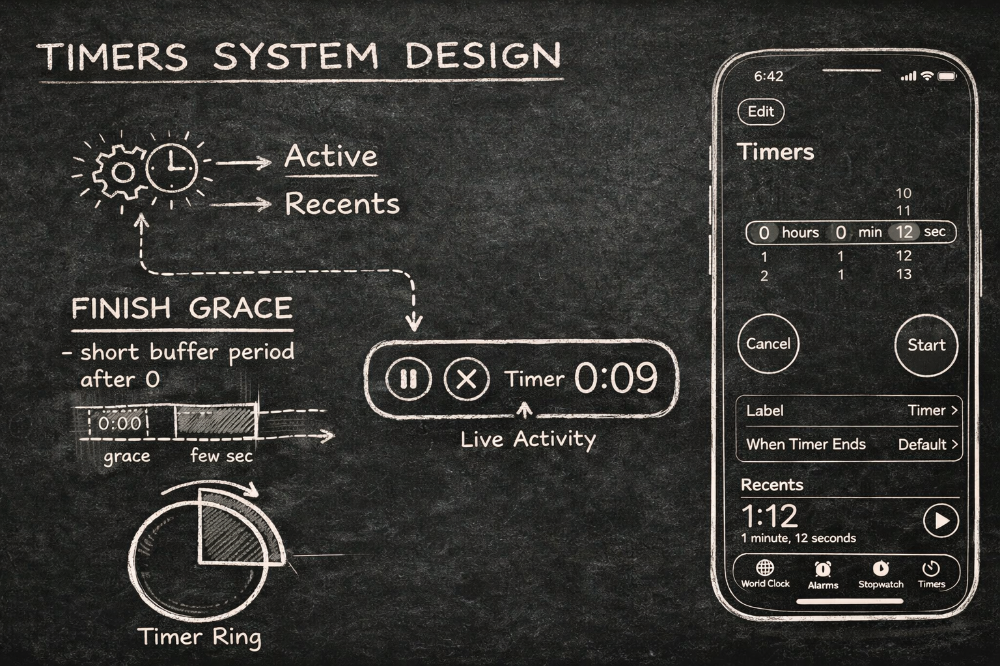
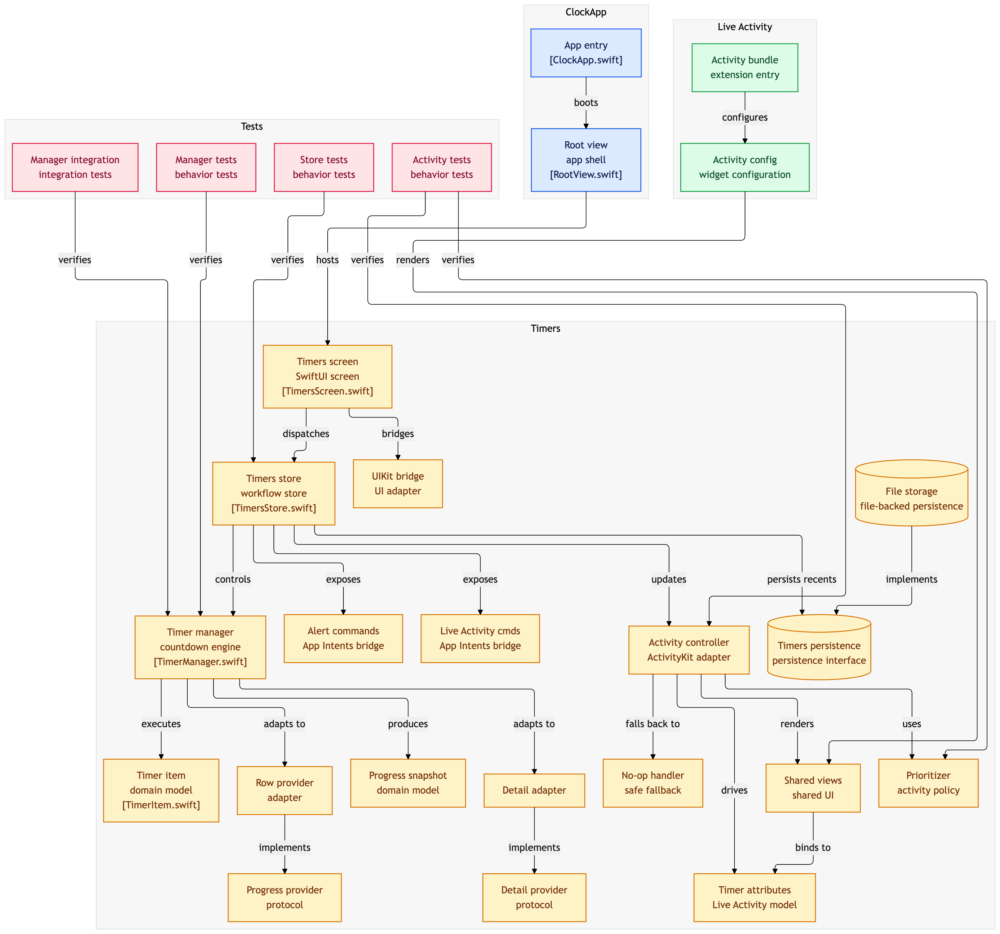

# ⏱️ ClockApp

A system design exploration of how the iOS Clock app might implement timers using **SwiftUI**, **Swift Concurrency**, and **Live Activities**.

This project focuses on **architecture and behavior**, not pixel-perfect UI replication (although it is almost identical).



---

## 🚀 Motivation

The goal of this project is to reverse engineer how a timer system like the iOS Clock app could work internally.

Instead of focusing on UI details, this project explores:

- How timers are modeled and executed
- How multiple timers coexist
- How system features like Live Activities are integrated
- How state, persistence, and time interact together

This is designed as a **learning and system design exercise**, not just a UI clone.

---

## 📱 System Requirements

- iOS 18+
- Xcode 26+
- Swift 6
- Physical device recommended for Live Activities

---

## 🧠 Architecture Overview


---

## 🧩 Components Breakdown

### 🧱 TimersStore

The central orchestrator of the app.

**Responsibilities:**
- Owns app state (`activeTimers`, `recentTimers`, `draft`)
- Handles user actions (start, pause, cancel)
- Coordinates persistence and Live Activities
- Reacts to timer completion

👉 Think of it as the **brain of the system**

---

### ⏳ TimerManager

The countdown engine.

**Responsibilities:**
- Tracks timer state (`running`, `paused`, `idle`)
- Uses `endDate` to compute remaining time
- Handles ticking and completion
- Triggers callbacks when finished

👉 This is the **core time engine**

---

### 💾 Persistence (FileTimersPersistence)

Stores recent timer presets.

**Responsibilities:**
- Save/load recents as JSON
- Recreate timer presets from disk

**Important:**
- Only **recents are persisted**
- Active timers are ephemeral

---

### 🧠 TimerLiveActivityPrioritizer

Determines which timer should be visible to the system.

**Responsibilities:**
- Sort timers by urgency
- Prefer running over paused timers
- Assign relevance scores for Live Activities

👉 This solves the **multiple timers problem**

---

### 📡 TimerActivityController

Bridge between app state and ActivityKit.

**Responsibilities:**
- Start Live Activities
- Update progress and state
- Trigger alert configuration
- End activities

👉 This is the **adapter to system UI**

---

## 🔑 Key Design Decisions

### 1. Using `endDate` instead of decrementing counters

Timers calculate remaining time based on current time:

```
remaining = endDate - now
```

**Benefits:**
- More accurate
- Resistant to delays or backgrounding
- Keeps animations smooth

---

### 2. Recents ≠ Active Timers

```
Recents = presets
Actives = running instances
```

**Benefits:**
- Reusability
- Multiple timers with same duration
- Clean persistence model

---

### 3. Single Source of Truth (Store Pattern)

All flows go through `TimersStore`.

**Benefits:**
- Predictable behavior
- Centralized logic
- Easier testing

---

### 4. Priority-Based Live Activity

Not all timers can dominate the system UI.

**Solution:**
- Introduce a prioritization layer
- Assign relevance scores
- Let the system surface the most important timer

---

### 5. Decoupling System Integrations

ActivityKit, persistence, and intents are abstracted:

- `TimerActivityHandling`
- `TimersPersistence`

**Benefits:**
- Testability
- Flexibility
- Clean architecture

---

### 6. The Finish Grace Gotcha (UX vs Real Time)

One of the most interesting discoveries in this project was the need for a **finish grace period**.

A strictly accurate timer would immediately hit zero and complete. However, this leads to a poor user experience:

- The UI jumps too quickly from `0:01` → finished
- The user never clearly sees `0:00`
- The transition feels abrupt and "wrong"

**Solution:**

A small grace offset (~0.5s) is added internally:

- The timer is technically finished
- But the UI is allowed to show `0:00` briefly
- The completion event is slightly delayed

**Why this matters:**

> Perfect accuracy is not always the best UX.

This is a subtle but critical detail that makes the timer feel **natural and polished**, similar to Apple's Clock app.

---

## ⚠️ Limitations

- Does not use AlarmKit (iOS 26+) for system alarms
- Alert behavior in foreground is limited by ActivityKit
- Only recent timers are persisted (not active ones)
- No cross-device sync
- No background execution guarantees beyond system limits

---

## 🧪 Testing

This project uses **Swift Testing (not XCTest)**.

**Covered areas:**
- Timer countdown behavior
- Store workflows (start, cancel, recents)
- Live Activity prioritization
- Integration tests with real time delays

**Focus:**
- Behavior over implementation
- Realistic scenarios

---

## 🔮 Future Improvements

- AlarmKit integration for system-level alerts
- Better foreground alert handling
- Background reliability improvements
- Cloud sync for timers
- Enhanced sound and vibration control
- Work on other tabs (Alarms, Stopwatch, World Clock)

---

## 🎥 Video (Coming Soon)

This project will be explained in detail on the **Swift and Tips** YouTube channel.

Stay tuned.

---

## 🧾 Final Thoughts

This is not just a timer app.

It’s a system that coordinates:

- Time
- State
- Priority
- Persistence
- System UI

---

If you find this useful, feel free to fork or adapt it for your own experiments 🚀
